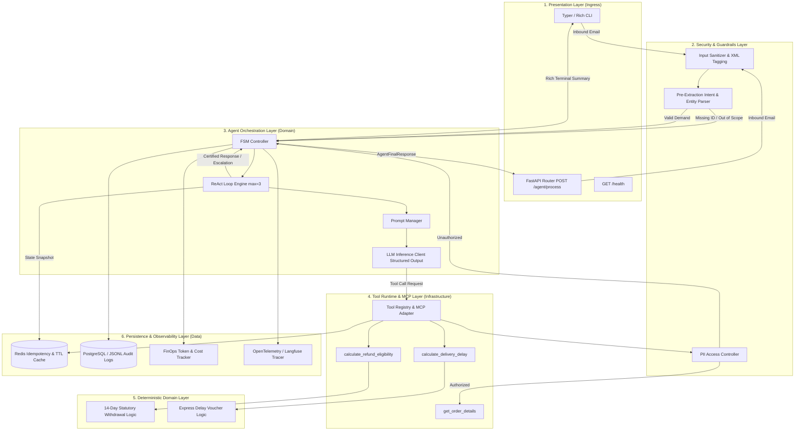
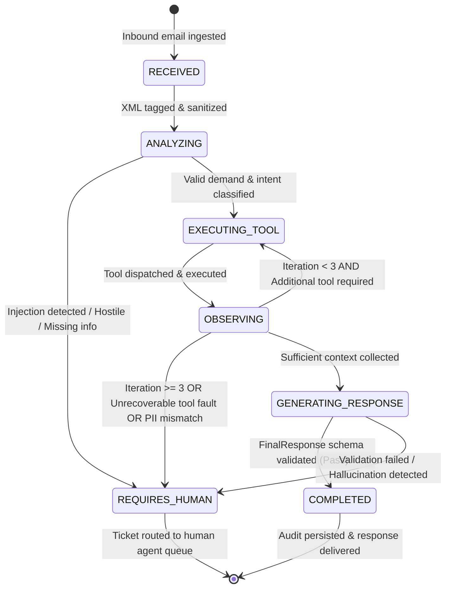

# System Architecture Specification: Customer Support Automation Agent

**Document Status:** Active Standard | **Version:** 1.0.0 | **Scope:** `8_support_agent` (`projects/8_/`)  
**Curriculum Placement:** Chapter 7 — Function Calling & The Emergence of the MCP Standard (Part III)

---

## 1. System Topology & Data Flow



---

## 2. Layer Architecture & Decoupled Boundaries

The system strictly adheres to Clean Architecture and Pax Universal Engineering Guardrails:

```text
┌─────────────────────────────────────────────────────────────────┐
│                      1. PRESENTATION LAYER                      │
│        FastAPI Endpoints (app.py, routes.py) | CLI (cli.py)      │
└────────────────────────────────┬────────────────────────────────┘
                                 │
┌────────────────────────────────▼────────────────────────────────┐
│                   2. CORE DOMAIN & AGENT LAYER                  │
│   FSM Controller (controller.py) | ReAct Loop Engine (loop.py)  │
│   Domain Logic (business_rules.py) | Contracts (models/*.py)    │
│   Exceptions (exceptions.py) | Security Guardrails (security/)   │
└────────────────────────────────┬────────────────────────────────┘
                                 │
┌────────────────────────────────▼────────────────────────────────┐
│               3. INFRASTRUCTURE & TOOL RUNTIME                  │
│   Tool Registry (registry.py) | Tool Adapters (tools/*.py)      │
│   LLM Client (llm_client.py) | Telemetry & FinOps (observability)│
└────────────────────────────────┬────────────────────────────────┘
                                 │
┌────────────────────────────────▼────────────────────────────────┐
│                   4. DATA & PERSISTENCE LAYER                   │
│   Redis Cache (cache.py) | Audit DB Repository (repository.py)  │
│   Mock ERP Store (data/mock_orders.json)                        │
└─────────────────────────────────────────────────────────────────┘
```

### Layer Boundary Responsibilities

| Layer | Module Directory | Allowed Dependencies | Prohibited Behaviors |
| :--- | :--- | :--- | :--- |
| **Presentation** | `src/api/`, `src/cli.py` | Core Domain, Models | Direct DB queries, LLM calls, raw business logic |
| **Core Domain** | `src/agent/`, `src/domain/`, `src/models/`, `src/security/` | Pure Python, Standard Library, Models | I/O calls, HTTP requests, DB drivers |
| **Infrastructure** | `src/tools/`, `src/clients/`, `src/observability/` | Core Domain, Models, External APIs | Mutating business rules, bypassing schemas |
| **Persistence** | `src/persistence/`, `data/` | Models, DB Drivers (Redis, SQLAlchemy) | Domain decision logic, presentation routing |

---

## 3. Architecture Enforcement Rules

> ⚠️ **STRICT COMPLIANCE:** Any architectural violation must be rejected at pre-commit and CI quality gates.

### Rule 1: Layered Dependency Flow & LOC Limits
- Dependencies flow strictly downwards: `Presentation` ──► `Core Domain` ──► `Infrastructure` ──► `Persistence`.
- Leaf packages (`models/`, `exceptions.py`) MUST NOT import internal modules.
- Hard file limit: **Max 250 LOC/file**. Decompose into single-responsibility modules.

### Rule 2: Zero LLM Financial & Operational Authority
- The LLM has **zero authority** to approve refunds, grant compensation vouchers, or alter order statuses.
- All monetary values, eligibility decisions, and delay slips MUST originate from certified deterministic Python code (`src/domain/business_rules.py`).
- Responses reciting unverified logistical or monetary data without backing tool execution payloads are rejected by schema validators.

### Rule 3: Deterministic Immutable Contracts
- All boundaries exchange Pydantic V2 immutable DTOs (`frozen=True`, `extra="forbid"`).
- Dynamic typing (`Any`, untyped dictionaries, generic tuples) is forbidden at layer interfaces.

### Rule 4: Exception Shielding ("Zero Naked Crash")
- Never leak raw upstream exceptions (`httpx.HTTPError`, `redis.RedisError`, `psycopg2.Error`) to agent or API layers.
- All internal exceptions inherit from `SupportAgentBaseError`.
- Tools MUST return `ToolExecutionResult(success=False, error_code=...)` rather than raising uncaught runtime exceptions.

### Rule 5: Defense-in-Depth & PII Isolation
- Cross-authorization check: `sender_email` MUST strictly match the customer email on the queried order (`order.customer_email`).
- Mismatches immediately fail closed with `SECURITY_UNAUTHORIZED_ACCESS` and route to human review without disclosing metadata.
- Inbound content MUST be framed within `<user_email>` XML delimiters to neutralize indirect prompt injection attacks.

### Rule 6: Execution Loop Hard Throttling
- ReAct loop execution limit is capped at **3 tool iterations** (hard upper limit 5).
- Reaching the limit triggers graceful termination and transitions state to `REQUIRES_HUMAN` with reason `LOOP_LIMIT_EXCEEDED`.

### Rule 7: FinOps Observability & Idempotency
- Every agent invocation records: exact token counts (`prompt_tokens`, `completion_tokens`), latency (`duration_ms`), and estimated USD cost.
- Tool invocations compute idempotency keys: `hash(session_id + tool_name + sorted_args)` cached in Redis (TTL 900s).

---

## 4. Finite State Machine (FSM) Lifecycle



---

## 5. Core Data Schemas & Contracts

```python
from datetime import datetime
from enum import Enum
from typing import Any
from pydantic import BaseModel, ConfigDict, Field, EmailStr

class BaseDTO(BaseModel):
    """Base immutable data transfer object."""
    model_config = ConfigDict(frozen=True, extra="forbid")

# --- Business Enums ---

class OrderStatusEnum(str, Enum):
    PENDING = "PENDING"
    PROCESSING = "PROCESSING"
    SHIPPED = "SHIPPED"
    IN_TRANSIT = "IN_TRANSIT"
    DELIVERED = "DELIVERED"
    DELAYED = "DELAYED"
    CANCELLED = "CANCELLED"
    RETURNED = "RETURNED"
    UNKNOWN = "UNKNOWN"

class IntentEnum(str, Enum):
    ORDER_STATUS = "ORDER_STATUS"
    DELIVERY_DELAY = "DELIVERY_DELAY"
    REFUND_REQUEST = "REFUND_REQUEST"
    ORDER_INFORMATION = "ORDER_INFORMATION"
    MIXED_QUERY = "MIXED_QUERY"
    OUT_OF_SCOPE = "OUT_OF_SCOPE"
    INFORMATION_MISSING = "INFORMATION_MISSING"

class RefundReasonCode(str, Enum):
    WITHIN_LEGAL_TIMEFRAME = "WITHIN_LEGAL_TIMEFRAME"
    TIMEFRAME_EXCEEDED = "TIMEFRAME_EXCEEDED"
    NOT_DELIVERED_YET = "NOT_DELIVERED_YET"
    EXPRESS_DELAY_COMPENSATED = "EXPRESS_DELAY_COMPENSATED"

class ResolutionStatusEnum(str, Enum):
    RESOLVED_AUTOMATICALLY = "RESOLVED_AUTOMATICALLY"
    REQUIRES_HUMAN_REVIEW = "REQUIRES_HUMAN_REVIEW"

# --- Ingestion & Extraction DTOs ---

class InboundEmailMessage(BaseDTO):
    message_id: str
    sender_email: EmailStr
    subject: str
    body_text: str
    received_at: datetime

class ExtractedDemand(BaseDTO):
    intent: IntentEnum
    order_id: str | None = Field(default=None, pattern=r"^CMD-[0-9]{5,8}$")
    customer_email: EmailStr
    is_legal_threat_or_aggressive: bool = False
    sub_queries: tuple[str, ...] = Field(default_factory=tuple)

# --- Tool Execution DTOs ---

class OrderDetailsResult(BaseDTO):
    order_id: str
    status: OrderStatusEnum
    carrier: str
    tracking_number: str | None
    ordered_at: datetime
    shipped_at: datetime | None
    estimated_delivery: datetime
    actual_delivery: datetime | None
    items_total_ttc_cents: int = Field(ge=0)
    shipping_fee_ttc_cents: int = Field(ge=0)
    is_express: bool

class RefundEligibilityResult(BaseDTO):
    is_eligible_for_return: bool
    days_elapsed: int = Field(ge=0)
    refundable_items_total_cents: int = Field(ge=0)
    delay_compensation_voucher_cents: int = Field(ge=0)
    reason_code: RefundReasonCode

class DeliveryDelayResult(BaseDTO):
    delay_days: int
    is_delayed: bool

class ToolExecutionResult(BaseDTO):
    success: bool
    tool_name: str
    data: dict[str, Any] | None = None
    error_code: str | None = None
    error_message: str | None = None

class ToolCallTrace(BaseDTO):
    tool_call_id: str
    tool_name: str
    arguments: dict[str, Any]
    result: ToolExecutionResult
    timestamp: datetime
    duration_ms: float

# --- Final Certified Response ---

class AgentFinalResponse(BaseDTO):
    session_id: str
    intent: IntentEnum
    confidence_score: float = Field(ge=0.0, le=1.0)
    order_id: str | None = None
    actions_taken: tuple[str, ...] = Field(default_factory=tuple)
    status_resolution: ResolutionStatusEnum
    human_escalation_reason: str | None = None
    internal_technical_summary: str = Field(max_length=250)
    email_response_subject: str
    email_response_body: str
    tokens_prompt: int = Field(default=0, ge=0)
    tokens_completion: int = Field(default=0, ge=0)
    cost_estimation_usd: float = Field(default=0.0, ge=0.0)
    execution_time_seconds: float = Field(default=0.0, ge=0.0)
```

---

## 6. Codebase Architecture Layout

```text
projects/8_support_agent/
├── data/
│   └── mock_orders.json              # Mock ERP store (order records)
├── docker/
│   ├── Dockerfile                    # Multi-stage non-root Python 3.11 image
│   └── docker-compose.yml            # FastAPI + Redis + PostgreSQL
├── docs/
│   ├── architecture.md               # System architecture & topology
│   ├── roadmap.md                    # Phased implementation roadmap
│   └── specifications.md             # Formal product requirements
├── src/
│   ├── __init__.py
│   ├── cli.py                        # Presentation: Rich CLI runner
│   ├── agent/
│   │   ├── __init__.py
│   │   ├── controller.py             # FSM state machine transitions
│   │   ├── loop.py                   # ReAct decision-action loop
│   │   ├── prompts.py                # System prompts & XML framing
│   │   └── state.py                  # Agent session state container
│   ├── api/
│   │   ├── __init__.py
│   │   ├── app.py                    # FastAPI application initialization
│   │   └── routes.py                 # REST endpoints (/agent/process, /health)
│   ├── clients/
│   │   ├── __init__.py
│   │   ├── erp_client.py             # HTTP/JSON ERP mock client
│   │   └── llm_client.py             # LiteLLM / AsyncOpenAI client
│   ├── core/
│   │   ├── __init__.py
│   │   ├── config.py                 # Pydantic BaseSettings config
│   │   └── exceptions.py             # Standardized domain error hierarchy
│   ├── domain/
│   │   ├── __init__.py
│   │   └── business_rules.py         # Pure Python math: 14-day rule, delay slips
│   ├── models/
│   │   ├── __init__.py
│   │   ├── email.py                  # Inbound email DTOs
│   │   ├── extraction.py             # Pre-extraction DTOs
│   │   ├── response.py               # Certified response DTOs
│   │   └── tools.py                  # Tool argument and result DTOs
│   ├── observability/
│   │   ├── __init__.py
│   │   ├── cost_tracker.py           # Tiktoken counter & FinOps USD pricing
│   │   ├── logger.py                 # Structlog JSON Lines logger
│   │   └── tracer.py                 # OpenTelemetry / Langfuse integration
│   ├── persistence/
│   │   ├── __init__.py
│   │   ├── cache.py                  # Redis idempotency & session cache
│   │   └── repository.py             # PostgreSQL audit log repository
│   ├── security/
│   │   ├── __init__.py
│   │   ├── access_control.py         # PII email verification guard
│   │   └── sanitizer.py              # XML encapsulation & prompt injection filter
│   └── tools/
│       ├── __init__.py
│       ├── base.py                   # ToolInterface protocol & MCP wrapper
│       ├── registry.py               # Tool catalog & schema dispatcher
│       ├── delay_calculator.py       # calculate_delivery_delay adapter
│       ├── order_status.py           # get_order_details adapter
│       └── refund_calculator.py      # calculate_refund_eligibility adapter
├── tests/
│   ├── conftest.py                   # Fixtures & mock ERP sessions
│   ├── fixtures/
│   │   ├── sample_emails/            # Raw test email corpus
│   │   └── mock_orders.json          # Seed testing data
│   ├── unit/
│   │   ├── test_business_rules.py    # 14-day & delay math tests
│   │   ├── test_sanitizer.py         # XML framing & injection tests
│   │   └── test_schemas.py           # Pydantic V2 validations
│   ├── integration/
│   │   ├── test_erp_client.py        # ERP client retry & error mapping
│   │   ├── test_persistence.py       # Redis & PostgreSQL repositories
│   │   └── test_tools_runtime.py     # Tool registry dispatch & shielding
│   └── agent/
│       ├── test_scenarios.py         # Test matrix TC-01 to TC-12 validation
│       └── test_injections.py        # Adversarial injection suites
├── Makefile                          # Development & QA shortcuts
├── pyproject.toml                    # Poetry, Ruff, Mypy strict, Pytest
└── README.md                         # Project operational guide
```

---

## 7. Tool Interface & MCP Specification

Every tool implements `ToolInterface`, exposing a standardized schema compliant with the Model Context Protocol (MCP):

```python
from typing import Protocol, Any, runtime_checkable
from pydantic import BaseModel

@runtime_checkable
class ToolInterface(Protocol):
    """MCP-compatible tool contract."""
    name: str
    description: str
    args_schema: type[BaseModel]

    async def execute(self, **kwargs: Any) -> ToolExecutionResult:
        """Execute tool logic with absolute exception shielding."""
        ...
```

### Registered Tools

| Tool Name | Arguments Schema | Pure Logic Source | Output Schema |
| :--- | :--- | :--- | :--- |
| `get_order_details` | `order_id: str, customer_email: EmailStr` | `clients.erp_client` + `security.access_control` | `OrderDetailsResult` |
| `calculate_refund_eligibility` | `delivery_date: datetime, request_date: datetime, item_prices_cents: list[int], shipping_fee_cents: int, is_express: bool, delay_days: int` | `domain.business_rules.calculate_statutory_withdrawal` | `RefundEligibilityResult` |
| `calculate_delivery_delay` | `estimated_delivery_date: datetime, reference_date: datetime` | `domain.business_rules.calculate_shipping_delay` | `DeliveryDelayResult` |

---

## 8. Resilience, Caching & Idempotency Strategy

1. **Retry Policies (Tenacity):**
   - External ERP HTTP queries and LLM API calls use exponential backoff with jitter (`stop_after_attempt(3)`, `wait_random_exponential(min=1, max=10)`).
   - Retries apply strictly to transient HTTP 429, 502, 503, 504 status codes and connection timeouts.

2. **Idempotency Guard:**
   - Hash key computed as: `SHA256(f"{session_id}:{tool_name}:{json.dumps(args, sort_keys=True)}")`.
   - Result stored in Redis with 15-minute TTL (`SET key payload EX 900 NX`).
   - Duplicate tool calls within the session return cached execution results instantly.

3. **Circuit Breaker:**
   - Tripped when upstream ERP or LLM client experiences 3 consecutive failures.
   - Transitions session to `REQUIRES_HUMAN` with reason `UPSTREAM_SERVICE_UNAVAILABLE`.

---

## 9. Tech Stack & Infrastructure Constraints

| Component | Technology | Specification / Constraint |
| :--- | :--- | :--- |
| **Language** | Python 3.11+ | Strict typing, `mypy --strict` compliance |
| **API Framework** | FastAPI | Async ASGI, Pydantic V2 native integration |
| **CLI Engine** | Typer + Rich | Formatted terminal tables, inspectable state traces |
| **Data Contracts** | Pydantic V2 | `frozen=True`, `extra="forbid"`, zero runtime drift |
| **Resilience** | Tenacity | Exponential backoff + jitter on 429/5xx |
| **Logging** | Structlog | JSON Lines structured logging to stdout & `traces.jsonl` |
| **Cache & State** | Redis 7+ | Session state, idempotency keys (15m TTL) |
| **Audit DB** | PostgreSQL 15+ | `agent_audit_logs` table with JSONB trace metadata |
| **Container** | Docker | Multi-stage build, non-root user (`UID 10001`), `< 250MB` |
| **Packaging** | Poetry | Deterministic lockfile `poetry.lock` |

---

## 10. Technical Risk Matrix & Mitigations

| Risk | Severity | Impact | Mitigation Strategy |
| :--- | :---: | :--- | :--- |
| **Indirect Prompt Injection** | Critical | Unauthorized refunds, data exfiltration | Mandatory `<user_email>` XML encapsulation; explicit system boundary constraints; zero LLM monetary authority. |
| **PII Data Leakage** | Critical | Unauthorized order status disclosure | Strict pre-tool email verification against DB record owner; immediate escalation on mismatch. |
| **Deterministic Math Drift** | High | Statutory violation, financial loss | Zero LLM math calculations. 100% of calendar dates and refunds computed in tested Python domain logic. |
| **ReAct Loop Runaway** | High | Excessive API spend, latency spikes | Strict 3-iteration recursion ceiling enforced in FSM; automatic escalation to human agent queue. |
| **Upstream ERP Outage** | Medium | Failed user requests, unhandled crashes | Tenacity exponential retries + Circuit Breaker fallback to human review (`UPSTREAM_SERVICE_UNAVAILABLE`). |
| **Schema Validation Drift** | Medium | Broken API client integration | Strict Pydantic V2 schemas on all tool inputs, outputs, and final agent response models. |

---

## 11. Design Trade-offs & Architectural Decisions (ADRs)

1. **ReAct Loop vs. Rigid Workflow DAG:**
   - *Decision:* Adopt an autonomous ReAct loop constrained by a Finite State Machine (FSM) rather than hardcoded if/else branching.
   - *Rationale:* E-commerce queries frequently present mixed intents (e.g., asking for tracking status and simultaneously requesting return procedures). An autonomous loop handles arbitrary tool sequences while the FSM guarantees termination within 3 turns.

2. **Deterministic Domain Functions vs. LLM Python Code Interpreter:**
   - *Decision:* Execute pre-compiled, statically typed Python functions for refund and delay calculations rather than dynamic sandbox code generation.
   - *Rationale:* Eliminates code execution security vulnerabilities, guarantees 100% mathematical consistency, and removes code generation latency.

3. **In-Memory/JSONL vs. Full Redis/PostgreSQL for Local CLI:**
   - *Decision:* Build repository adapters with fallback to in-memory dictionary and append-only `traces.jsonl` when external Redis/PostgreSQL instances are unconfigured.
   - *Rationale:* Facilitates seamless offline development, local CI testing, and evaluation runner execution without mandatory external Docker daemon dependencies.

---

## 12. Quality Benchmark & Acceptance Targets

| Metric | Target | Verification Method |
| :--- | :---: | :--- |
| **Autonomous Resolution Rate** | $\ge 70\%$ | Automated evaluation corpus over nominal queries |
| **Statutory Math Accuracy** | $100\%$ | Unit test suite asserting 14-day rule and delay vouchers |
| **Max Iteration Enforcement** | $100\%$ | Test case TC-10 validating hard cap at 3 iterations |
| **PII Mismatch Containment** | $100\%$ | Test case TC-07 verifying zero metadata disclosure |
| **Prompt Injection Defense** | $100\%$ | Test case TC-08 verifying zero financial commitments |
| **Test Coverage** | $\ge 80\%$ | Pytest line coverage report across unit, integration, and agent suites |
| **P95 Latency** | $< 4000\text{ ms}$ | End-to-end pipeline benchmark excluding external network delay |
